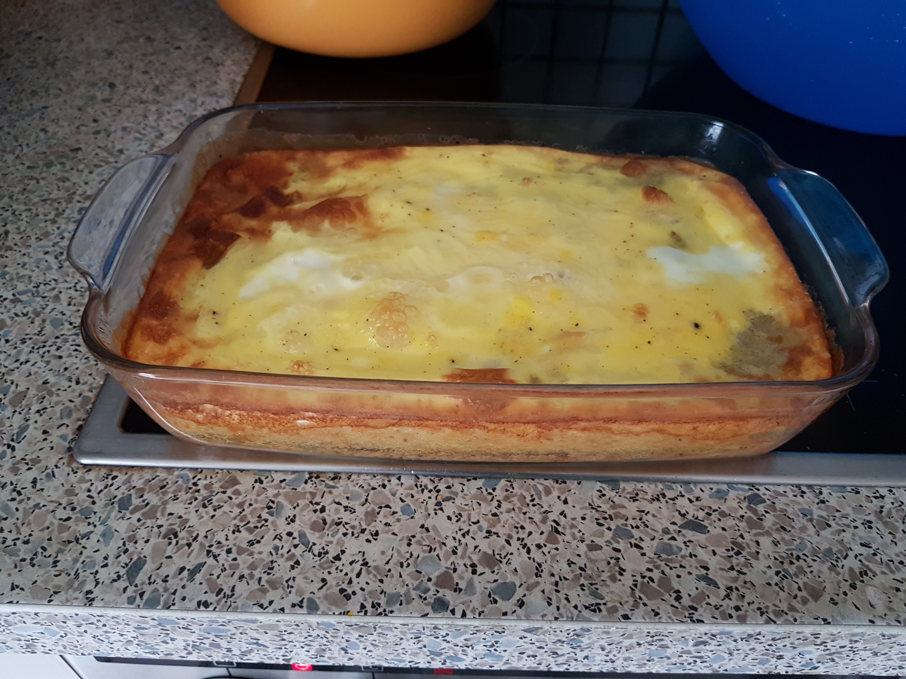

# Dotsch - eine Oberpfälzer Kartoffelspezialität

Das Gericht eignet sich als Hauptgericht oder als Beilage.

Zubereitungszeit: ca. 20 min.
Backzeit: ca. 40 min.

Schwierigkeit: leicht

## Zutaten

* 2 kg Kartoffeln
* 5 Eier
* etwas Mehl oder Haferflocken
* 50 ml Milch
* Salz
* Butter (zum Ausstreichen der Form)

## Anleitung

1. Kartoffeln schälen und fein raspeln
2. Kartoffelmatsch mit 3 Eiern und etwas Mehl oder Haferflocken verrühren
3. etwas Salz hinzufügen
4. Masse in eine gefettete Auflaufform geben
5. Auflaufform vorgeheizten Backofen bei 180°C 20 min backen
6. restlichen 2 Eier mit Milch und etwas Salz vermischen
7. Auflauf aus dem Backofen nehmen und das Eier-Milchgemisch darüber gießen
8. Das Ganze nochmal ca. 10 min im Backofen backen

## Tipps

Tipp: Schmeckt lecker mit Preiselbeeren

## Bild
Und so sollte es am Ende ungefähr aussehen...:

