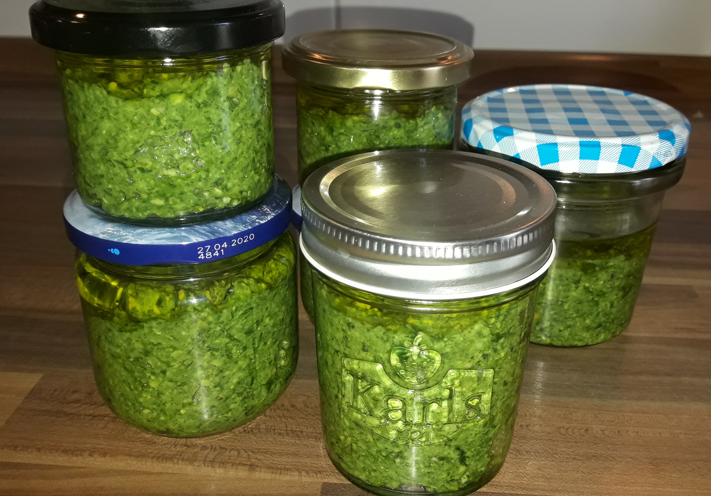

# Bärlauchpesto zur Pasta

Aus Bärlauch lässt sich sehr einfach und schnell ein leckeres, vegatarisches Pesto herstellen, dass gekühlt ein paar Monate im Kühlschrank haltbar ist und schnell an die heiße oder kalte Pasta gerührt werden kann. Es kann aber auch als Marinade für Fleischgerichte verwendet werden. Die Herstellung dauert etwa 15 Minuten.

## Zutaten

Hier wird nur die Herstellung des Pestos beschrieben. Das Rezept reicht für ein Marmeladenglas (ca. 350 ml). Die Zutaten bei Bedarf also einfach mit der Glasanzahl multiplizieren.
* 100 gr Bärlauch
* 50 gr Nüsse, z. B. Pinienkerne, Wallnüsse, ...
* 75 gr Olivenöl
* 75 gr Parmesan

## Anleitung

Das Glas muss richtig sauber sein, insbesondere wenn du auf Vorrat herstellst. Die Deckel koche ich vorher ca. 10 Minuten aus. Glas und Deckel müssen wieder abgekühlt sein.
1. Bärlauch waschen und trocken schleudern
2. Alle Zutaten mit dem Mixer bzw. Pürierstab verkleinern
3. Mit Pfeffer abschmecken
4. Ab ins Glas ...

**Wichtig:** Im Glas sollten für die Lagerung keine eingeschlossenen Luftblasen sein. Weiterhin muss das Pesto mit Öl zugedeckt werden, d. h. es muss sich eine geschlossene Schicht Öl oben drauf befinden.

## Tipps

### Bärlauch sammeln
Wer Bärlauch selbst sammeln will, kann sich mal auf [Mundraub.org](https://mundraub.org) schlaumachen, wo in der Nähe welcher wächst. Achtung: Prinzipiell auf Erntbarkeit, z. B. Naturschutzgebiet, Menge usw. achten.
### Lagerung
Ich stelle immer im Frühjahr so ca. 10 Gläser her und die lagere ich dann im Kühlschrank bis zu einem Jahr. Häufig sind sie aber schon eher aufgebraucht :-)
### Endlich essen
Wenn es dann ans Essen geht einfach die Nudeln deinen Wahl kochen. Das Pesto nimmt sich bei uns jeder selbst nach belieben und verrührt es direkt auf dem Teller. Da Bärlauch intensiver schmeckt, als z. B. Balilikum, nimmt da jeder nach seinem Gusto.

## Bild

